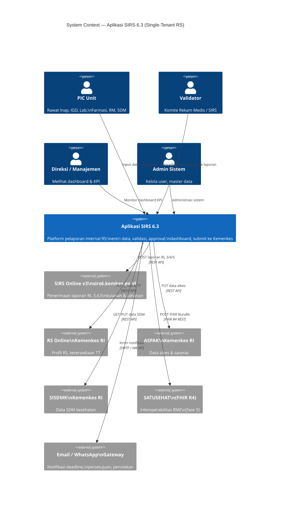
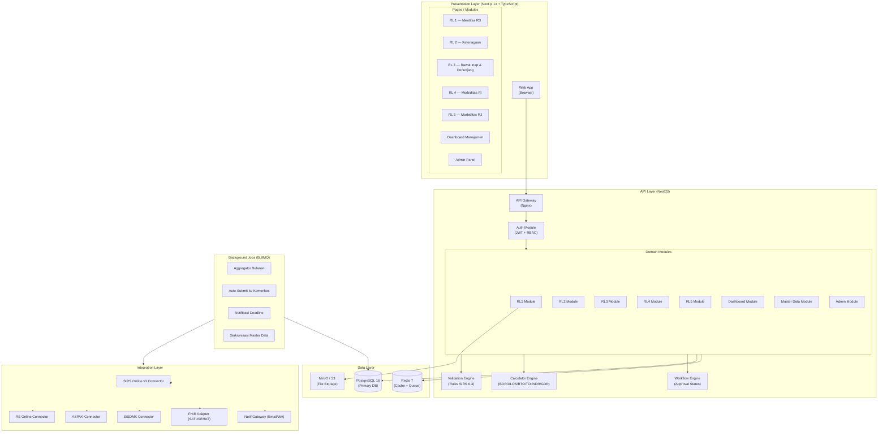
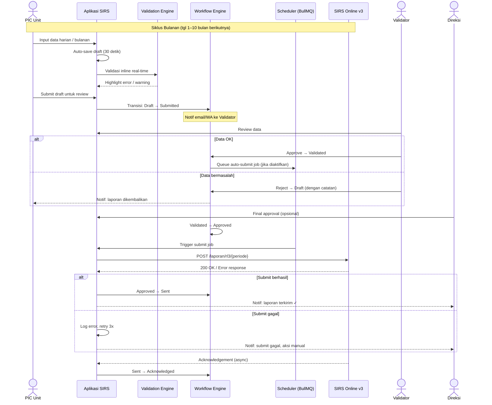

# 01 — Arsitektur Sistem SIRS 6.3

**Single-Tenant | NestJS | PostgreSQL | Next.js**

---

## Daftar Isi

1. [Gambaran Sistem](#1-gambaran-sistem)
2. [System Context Diagram](#2-system-context-diagram)
3. [Component Architecture](#3-component-architecture)
4. [Data Flow — Siklus Pelaporan](#4-data-flow--siklus-pelaporan)
5. [Deployment Topology](#5-deployment-topology)
6. [Keputusan Teknologi](#6-keputusan-teknologi)

---

## 1. Gambaran Sistem

Aplikasi SIRS 6.3 adalah sistem pelaporan internal rumah sakit yang berfungsi sebagai:

- **Pusat agregasi data** dari seluruh unit (IRNA, IGD, Lab, Farmasi, Rekam Medis, SDM)
- **Engine validasi** sesuai aturan JUKNIS SIRS 6.3 Kemenkes RI
- **Gateway pelaporan** ke aplikasi Kemenkes (SIRS Online v3, RS Online, ASPAK, SISDMK)
- **Dashboard manajemen** indikator pelayanan real-time

Karena tidak ada SIMRS eksisting, sistem ini sekaligus berperan sebagai **sumber data primer** dengan modul entri manual yang lengkap dan data dummy/seed untuk development.

---

## 2. System Context Diagram



---

## 3. Component Architecture



---

## 4. Data Flow — Siklus Pelaporan Bulanan



---

## 5. Deployment Topology

```
┌─────────────────────────────────────────────────────────────────┐
│                    Server On-Premise RS                         │
│                                                                 │
│  ┌──────────────┐    ┌──────────────┐    ┌──────────────────┐  │
│  │   Nginx      │    │  Next.js     │    │   NestJS API     │  │
│  │  (Reverse    │───▶│  Frontend    │    │   (Port 3001)    │  │
│  │   Proxy)     │    │  (Port 3000) │    │                  │  │
│  │  Port 80/443 │    └──────────────┘    └──────┬───────────┘  │
│  └──────────────┘                               │              │
│                                                 ▼              │
│  ┌──────────────┐    ┌──────────────┐    ┌──────────────────┐  │
│  │  PostgreSQL  │    │    Redis     │    │     MinIO        │  │
│  │  (Port 5432) │◀───│  (Port 6379) │    │  (Port 9000)     │  │
│  │  Primary DB  │    │  Cache+Queue │    │  File Storage    │  │
│  └──────────────┘    └──────────────┘    └──────────────────┘  │
│                                                                 │
│  ┌──────────────────────────────────────────────────────────┐  │
│  │              Docker Compose / Kubernetes                 │  │
│  └──────────────────────────────────────────────────────────┘  │
└─────────────────────────────────────────────────────────────────┘
                              │
                         Internet (HTTPS)
                              │
        ┌─────────────────────┼───────────────────┐
        ▼                     ▼                   ▼
  SIRS Online v3          RS Online           ASPAK/SISDMK
  (Kemenkes)              (Kemenkes)          (Kemenkes)
```

**Spesifikasi Server Minimum (On-Premise):**

| Komponen | Minimum | Rekomendasi |
|---|---|---|
| CPU | 4 core | 8 core |
| RAM | 8 GB | 16 GB |
| Storage | 500 GB SSD | 1 TB SSD |
| OS | Ubuntu 22.04 LTS | Ubuntu 22.04 LTS |
| Network | 100 Mbps | 1 Gbps |

---

## 6. Keputusan Teknologi

| Layer | Teknologi | Versi | Alasan |
|---|---|---|---|
| **Frontend** | Next.js + TypeScript | 14.x (App Router) | SSR untuk SEO & performa, App Router untuk layout terstruktur per modul RL |
| **UI Components** | shadcn/ui + Tailwind CSS | latest | Komponen aksesibel, customizable, cocok untuk form medis kompleks |
| **State Management** | Zustand + React Query | latest | Zustand untuk UI state, React Query untuk server state & cache |
| **Backend** | NestJS + TypeScript | 10.x | Modular architecture cocok dengan struktur per-RL, decorator pattern untuk validation |
| **ORM** | Prisma | 5.x | Type-safe, migrasi otomatis, schema-first, cocok untuk PostgreSQL |
| **Database** | PostgreSQL | 16.x | Partitioning native, JSONB, Row-Level Security, materialized views |
| **Cache / Queue** | Redis + BullMQ | 7.x / 5.x | BullMQ untuk job scheduling & retry logic pelaporan Kemenkes |
| **File Storage** | MinIO | latest | S3-compatible, on-premise, untuk upload dokumen SK/Izin |
| **Auth** | JWT + Passport.js | — | Stateless auth, refresh token rotation, RBAC middleware |
| **Validasi** | class-validator + Zod | — | class-validator untuk NestJS DTO, Zod untuk shared schema |
| **Email** | Nodemailer + MJML | — | Transactional email untuk notifikasi deadline |
| **Testing** | Jest + Supertest | — | Unit + integration testing |
| **CI/CD** | GitHub Actions | — | Automated build, test, deploy pipeline |
| **Container** | Docker + Compose | — | Reproducible dev & prod environment |

---

## Catatan Arsitektur Khusus

### Kenapa Single-Tenant (bukan Multi-Tenant)?

Untuk 1 RS: database schema lebih sederhana (tidak perlu `rs_id` di setiap tabel), Row-Level Security tidak diperlukan, performa query lebih optimal karena tidak ada partition per-tenant.

### Kenapa Prisma bukan TypeORM?

Prisma memberikan type-safety yang lebih ketat untuk data medis, migrasi lebih aman (diff-based), dan developer experience lebih baik. TypeORM lebih fleksibel tetapi lebih rentan runtime error.

### Kenapa BullMQ untuk Scheduler?

Karena pelaporan ke Kemenkes harus reliable: BullMQ mendukung retry dengan exponential backoff, job persistence di Redis (tidak hilang saat restart), dan dead letter queue untuk laporan yang gagal.
