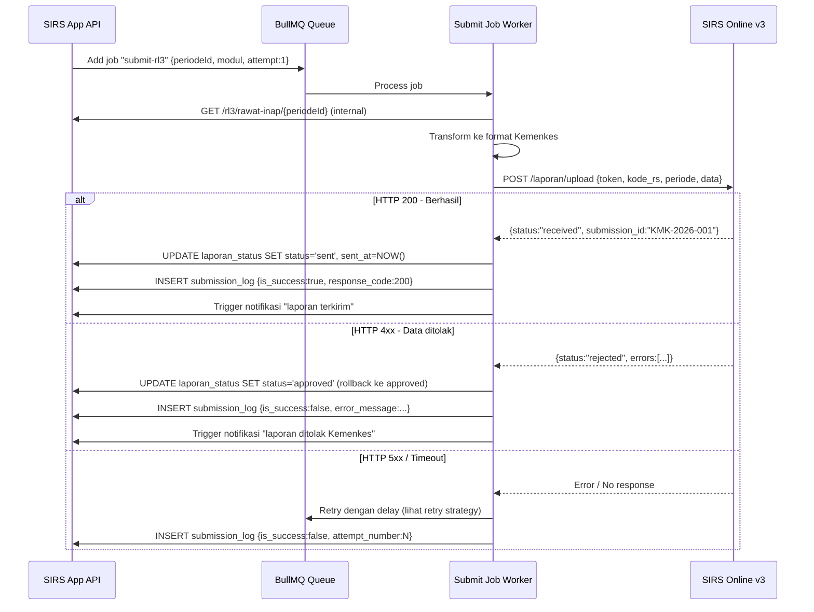

# 06 — Spesifikasi Integrasi

**SIMRS Dummy | SIRS Online v3 | RS Online | ASPAK | SISDMK | SATUSEHAT FHIR**

---

## Daftar Isi

1. [Strategi Integrasi Umum](#1-strategi-integrasi-umum)
2. [SIMRS Dummy (Data Generator)](#2-simrs-dummy-data-generator)
3. [SIRS Online v3 — Auto-Submit](#3-sirs-online-v3--auto-submit)
4. [RS Online — Profil & TT](#4-rs-online--profil--tt)
5. [ASPAK — Peralatan](#5-aspak--peralatan)
6. [SISDMK — SDM Kesehatan](#6-sisdmk--sdm-kesehatan)
7. [SATUSEHAT FHIR R4 (Fase 5)](#7-satusehat-fhir-r4-fase-5)
8. [Error Handling & Retry Strategy](#8-error-handling--retry-strategy)
9. [Notifikasi Gateway](#9-notifikasi-gateway)

---

## 1. Strategi Integrasi Umum

### Prinsip Utama

- **Outbound only** ke Kemenkes: SIRS ini push data, tidak pull. Kemenkes tidak query ke server RS.
- **Asynchronous**: semua pengiriman ke Kemenkes dijalankan via BullMQ job, bukan synchronous HTTP call dari request user.
- **Idempotent**: setiap submission diberi `submission_id` unik; retry aman karena Kemenkes harus tolak duplikat.
- **Fallback**: jika API Kemenkes down, data tersimpan di queue dengan retry eksponensial; PIC dapat export manual.

### Alur Integrasi Global

```
User (Approver)
    │
    ▼ POST /integrasi/submit-sirs-online
┌───────────────────┐
│  IntegrationCtrl  │ → Enqueue BullMQ Job "submit-kemenkes"
└───────────────────┘
         │
         ▼ (async, background)
┌────────────────────────────────┐
│  SubmitKemenkesJob (BullMQ)    │
│  1. Fetch data dari PostgreSQL │
│  2. Transform ke format SIRS   │
│  3. POST ke API Kemenkes       │
│  4. Catat response di DB       │
│  5. Update status workflow     │
│  6. Kirim notifikasi           │
└────────────────────────────────┘
```

---

## 2. SIMRS Dummy (Data Generator)

Karena belum ada SIMRS eksisting, sistem ini menggunakan **data generator** yang mensimulasikan data yang biasanya datang dari SIMRS.

### Mode Operasi

1. **Manual Entry** (default): PIC input data langsung via form web
2. **Dummy Auto-Generate**: script menghasilkan data dummy realistis untuk development & demo
3. **Future: SIMRS Connector** (placeholder, untuk ketika ada SIMRS)

### Script Dummy Data Generator

```typescript
// scripts/seed.ts
// Menghasilkan 6 bulan data dummy yang realistis

import { PrismaClient } from '@prisma/client';
import { faker } from '@faker-js/faker/locale/id_ID';
import { hitungBOR, hitungALOS, hitungBTO, hitungTOI, hitungNDR, hitungGDR }
  from '../packages/sirs-calculator/src';

const prisma = new PrismaClient();

async function generateSensusHarian(
  bulan: number, tahun: number
) {
  const kelasTtList = await prisma.masterKelasTt.findMany({ where: { isActive: true } });
  const jenisPelList = await prisma.masterJenisPelayanan.findMany({ where: { isActive: true } });

  const hariDalamBulan = new Date(tahun, bulan, 0).getDate();

  for (let hari = 1; hari <= hariDalamBulan; hari++) {
    const tanggal = new Date(tahun, bulan - 1, hari);

    for (const kelasTt of kelasTtList) {
      for (const jenisPel of jenisPelList.slice(0, 5)) {
        // Simulasi data realistic per kelas TT
        const pasienAwal = faker.number.int({ min: 20, max: 80 });
        const masukBaru  = faker.number.int({ min: 3,  max: 15 });
        const masukPind  = faker.number.int({ min: 0,  max: 3  });
        const keluarH    = faker.number.int({ min: 2,  max: 12 });
        const matiLt48   = faker.number.int({ min: 0,  max: 2  });
        const matiGe48   = faker.number.int({ min: 0,  max: 1  });
        const dipindah   = faker.number.int({ min: 0,  max: 2  });

        await prisma.rl3SensusHarian.upsert({
          where: {
            tanggal_kelasTtId_jenisPelayananId: {
              tanggal, kelasTtId: kelasTt.id, jenisPelayananId: jenisPel.id
            }
          },
          update: {},
          create: {
            tanggal,
            kelasTtId: kelasTt.id,
            jenisPelayananId: jenisPel.id,
            pasienAwal,
            masukBaru,
            masukPindahan: masukPind,
            keluarHidup: keluarH,
            keluarMatiLt48jam: matiLt48,
            keluarMatiGe48jam: matiGe48,
            dipindahkan: dipindah,
            hariPerawatan: pasienAwal + masukBaru + masukPind - keluarH - matiLt48 - matiGe48 - dipindah
          }
        });
      }
    }
  }
}

async function generateMorbiditasRI(periodeId: string) {
  const icd10Sample = await prisma.masterIcd10.findMany({
    where: { isActive: true },
    take: 50,
    orderBy: { kode: 'asc' }
  });

  const kelompokUmur = await prisma.masterKelompokUmur.findMany();

  for (const icd of icd10Sample) {
    for (const ku of kelompokUmur.slice(5, 15)) {
      const kasusBL = faker.number.int({ min: 0, max: 50 });
      const kasusBP = faker.number.int({ min: 0, max: 50 });

      await prisma.rl41MorbiditasRi.create({
        data: {
          periodeId,
          icd10Id: icd.id,
          kelompokUmurId: ku.id,
          kasusBaL: kasusBL,
          kasusBaP: kasusBP,
          matiL: faker.number.int({ min: 0, max: Math.floor(kasusBL * 0.05) }),
          matiP: faker.number.int({ min: 0, max: Math.floor(kasusBP * 0.05) }),
          totalHariRawat: (kasusBL + kasusBP) * faker.number.int({ min: 2, max: 7 })
        }
      });
    }
  }
}
```

### Placeholder untuk SIMRS Connector

```typescript
// apps/api/src/modules/integrasi/connectors/simrs.connector.ts
// Ini adalah placeholder. Ketika ada SIMRS, implementasikan di sini.

export interface SimrsConnectorInterface {
  getSensusHarian(tanggal: Date): Promise<SensusHarianRaw[]>;
  getKunjunganRawatJalan(bulan: number, tahun: number): Promise<KunjunganRJRaw[]>;
  getDiagnosisRawatInap(bulan: number, tahun: number): Promise<DiagnosisRIRaw[]>;
  getDataFarmasi(bulan: number, tahun: number): Promise<FarmasiRaw[]>;
}

// Implementasi dummy (untuk development)
export class SimrsDummyConnector implements SimrsConnectorInterface {
  async getSensusHarian(tanggal: Date): Promise<SensusHarianRaw[]> {
    // Return data dari PostgreSQL (sudah di-seed)
    return this.prisma.rl3SensusHarian.findMany({ where: { tanggal } });
  }
  // ... implementasi lainnya
}
```

---

## 3. SIRS Online v3 — Auto-Submit

### Flow Pengiriman



### Format Payload SIRS Online v3

```typescript
// Contoh format RL 3.1 (sesuai dokumentasi SIRS Online v3.0.0)
interface SirsOnlineRL31Payload {
  kode_rs: string;
  tahun: number;
  bulan: number;
  data_indikator: {
    kelas_tt: string;
    tt_tersedia: number;
    hari_perawatan: number;
    pasien_keluar_hidup: number;
    pasien_keluar_mati: number;
    pasien_mati_lt48: number;
    lama_dirawat_total: number;
    bor: number;
    alos: number;
    bto: number;
    toi: number;
    ndr: number;
    gdr: number;
  }[];
}

// Transformer
export function transformRL31ToSirsOnline(
  data: Rl31IndikatorRecord[],
  rsKode: string,
  tahun: number,
  bulan: number
): SirsOnlineRL31Payload {
  return {
    kode_rs: rsKode,
    tahun,
    bulan,
    data_indikator: data.map(d => ({
      kelas_tt: d.masterKelasTt.kode,
      tt_tersedia: d.ttTersedia,
      hari_perawatan: d.hariPerawatan,
      pasien_keluar_hidup: d.pasienKeluarHidup,
      pasien_keluar_mati: d.pasienKeluarMati,
      pasien_mati_lt48: d.pasienMatiLt48,
      lama_dirawat_total: d.lamaDirawatTotal,
      bor: d.bor,
      alos: d.alos,
      bto: d.bto,
      toi: d.toi,
      ndr: d.ndr,
      gdr: d.gdr
    }))
  };
}
```

### Konfigurasi BullMQ Job

```typescript
// apps/api/src/modules/scheduler/jobs/auto-submit-kemenkes.job.ts
import { Job } from 'bullmq';

export const SUBMIT_KEMENKES_QUEUE = 'submit-kemenkes';

export const submitKemenkesJobOptions = {
  attempts: 5,
  backoff: {
    type: 'exponential',
    delay: 5 * 60 * 1000,  // mulai 5 menit, kemudian 10, 20, 40 menit
  },
  removeOnComplete: { count: 100 },
  removeOnFail: { count: 50 },
};

// Cron: setiap hari tgl 5-9 jam 08.00 (pre-deadline reminder submission)
export const AUTO_SUBMIT_CRON = '0 8 5-9 * *';
```

---

## 4. RS Online — Profil & TT

### Endpoint RS Online

```typescript
// apps/api/src/modules/integrasi/connectors/rs-online.connector.ts

export class RsOnlineConnector {
  private readonly baseUrl = process.env.RS_ONLINE_BASE_URL;
  private readonly apiKey  = process.env.RS_ONLINE_API_KEY;

  async updateProfil(profil: RsProfilData): Promise<void> {
    await this.httpClient.put('/fasilitas-kesehatan/profil', {
      kode_rs:            profil.kodeRs,
      nama_rs:            profil.namaRs,
      kelas:              profil.kelasRs,
      jenis:              profil.jenisRs,
      kepemilikan:        profil.kepemilikan,
      status_akreditasi:  profil.statusAkreditasi,
      // ... field lainnya sesuai dokumentasi RS Online
    }, {
      headers: { 'X-Api-Key': this.apiKey }
    });
  }

  async updateKetersediaanTT(
    data: { kelas_tt: string; jumlah: number }[]
  ): Promise<void> {
    await this.httpClient.put('/fasilitas-kesehatan/tempat-tidur', {
      kode_rs: process.env.KODE_RS,
      data_tt: data,
      tanggal_update: new Date().toISOString()
    });
  }
}
```

### Jadwal Sinkronisasi RS Online

| Data | Frekuensi | Trigger |
|---|---|---|
| Profil RS | Manual | Setelah ada perubahan data profil |
| Ketersediaan TT | 2x/hari | Setelah input sensus pagi & sore |
| Status akreditasi | Manual | Setelah perpanjangan sertifikat |

---

## 5. ASPAK — Peralatan

```typescript
// apps/api/src/modules/integrasi/connectors/aspak.connector.ts

export class AspakConnector {
  async syncPeralatan(peralatan: Rl1PeralatanData[]): Promise<void> {
    // ASPAK menggunakan format XML atau JSON tergantung versi
    const payload = {
      kode_rs: process.env.KODE_RS,
      tahun: new Date().getFullYear(),
      data_alkes: peralatan.map(p => ({
        kode_aspak: p.kodeAspak,
        nama_alat: p.namaAlat,
        jumlah_ada: p.jumlahAda,
        jumlah_berfungsi: p.jumlahBerfungsi
      }))
    };

    const response = await this.httpClient.post('/upload/alkes', payload);
    return response.data;
  }
}
```

---

## 6. SISDMK — SDM Kesehatan

```typescript
// apps/api/src/modules/integrasi/connectors/sisdmk.connector.ts

export class SisdmkConnector {
  async syncKetenagaan(
    periodeId: string,
    data: Rl2KetenagaanData[]
  ): Promise<void> {
    // SISDMK: POST data agregat per jenis nakes
    await this.httpClient.post('/rs/laporan-sdm', {
      kode_rs: process.env.KODE_RS,
      periode: periodeId,
      data_sdm: data.map(d => ({
        kode_nakes:      d.kodeNakes,
        pendidikan:      d.pendidikan,
        status_pegawai:  d.statusPegawai,
        jenis_kelamin:   d.jenisKelamin,
        jumlah:          d.jumlah
      }))
    });
  }

  async pullDataNakes(): Promise<NakesFromSisdmk[]> {
    // Ambil data nakes dari SISDMK untuk cross-check
    const response = await this.httpClient.get(
      `/rs/data-sdm?kode_rs=${process.env.KODE_RS}`
    );
    return response.data.data_sdm;
  }
}
```

---

## 7. SATUSEHAT FHIR R4 (Fase 5)

### Resource Mapping SIRS → FHIR

| Data SIRS | FHIR Resource | Keterangan |
|---|---|---|
| Pasien rawat inap | `Patient` | Hanya data agregat, bukan identitas |
| Episode rawat inap | `Encounter` | Per-pasien keluar |
| Diagnosis (ICD-10) | `Condition` | Linked ke `Encounter` |
| Tindakan medis | `Procedure` | Operasi, tindakan khusus |
| Hasil lab | `Observation` | Agregat per kategori |
| Obat yang diberikan | `MedicationDispense` | Per-resep |
| Kunjungan rawat jalan | `Appointment` | Diagregasi |

### Contoh FHIR Bundle untuk 1 Episode Rawat Inap

```json
{
  "resourceType": "Bundle",
  "type": "transaction",
  "entry": [
    {
      "resource": {
        "resourceType": "Encounter",
        "id": "enc-2026-001",
        "status": "finished",
        "class": {
          "system": "http://terminology.hl7.org/CodeSystem/v3-ActCode",
          "code": "IMP",
          "display": "inpatient encounter"
        },
        "type": [
          {
            "coding": [
              {
                "system": "http://snomed.info/sct",
                "code": "11429006",
                "display": "Consultation"
              }
            ]
          }
        ],
        "subject": { "reference": "Patient/pat-anonymized-001" },
        "period": {
          "start": "2026-04-01T08:00:00+07:00",
          "end": "2026-04-05T14:00:00+07:00"
        },
        "diagnosis": [
          {
            "condition": { "reference": "Condition/cond-001" },
            "rank": 1
          }
        ],
        "hospitalization": {
          "dischargeDisposition": {
            "coding": [
              {
                "system": "http://terminology.hl7.org/CodeSystem/discharge-disposition",
                "code": "home"
              }
            ]
          }
        }
      }
    },
    {
      "resource": {
        "resourceType": "Condition",
        "id": "cond-001",
        "clinicalStatus": {
          "coding": [{ "code": "resolved" }]
        },
        "code": {
          "coding": [
            {
              "system": "http://hl7.org/fhir/sid/icd-10",
              "code": "I10",
              "display": "Hipertensi esensial"
            }
          ]
        },
        "subject": { "reference": "Patient/pat-anonymized-001" },
        "encounter": { "reference": "Encounter/enc-2026-001" }
      }
    }
  ]
}
```

### FHIR Adapter NestJS

```typescript
// apps/api/src/modules/integrasi/connectors/satusehat-fhir.connector.ts

export class SatusehatFhirConnector {
  private accessToken: string;
  private tokenExpiry: Date;

  async authenticate(): Promise<void> {
    const response = await this.httpClient.post(
      `${process.env.SATUSEHAT_BASE_URL}/oauth2/token`,
      new URLSearchParams({
        grant_type:    'client_credentials',
        client_id:     process.env.SATUSEHAT_CLIENT_ID,
        client_secret: process.env.SATUSEHAT_CLIENT_SECRET
      })
    );
    this.accessToken = response.data.access_token;
    this.tokenExpiry = new Date(Date.now() + response.data.expires_in * 1000);
  }

  async postBundle(bundle: FhirBundle): Promise<void> {
    if (!this.accessToken || new Date() >= this.tokenExpiry) {
      await this.authenticate();
    }

    await this.httpClient.post(
      `${process.env.SATUSEHAT_BASE_URL}/`,
      bundle,
      { headers: { Authorization: `Bearer ${this.accessToken}` } }
    );
  }

  async mapRl4ToFhirBundle(
    data: Rl41MorbiditasRiData[],
    periode: string
  ): Promise<FhirBundle> {
    // Transform morbiditas agregat ke FHIR Bundle
    // (implementasi detail di fase 5)
    return { resourceType: 'Bundle', type: 'transaction', entry: [] };
  }
}
```

---

## 8. Error Handling & Retry Strategy

### Exponential Backoff untuk BullMQ

```
Attempt 1: segera
Attempt 2: +5 menit
Attempt 3: +10 menit
Attempt 4: +20 menit
Attempt 5: +40 menit
→ Setelah 5x gagal: masuk Dead Letter Queue, kirim alert ke admin
```

### Tabel Penanganan Error per Jenis

| Error | Aksi Otomatis | Notifikasi |
|---|---|---|
| `HTTP 401` (token expired) | Re-authenticate, retry | — |
| `HTTP 422` (data ditolak) | Catat rejection reason, rollback ke `approved` | Email ke APPROVER + VALIDATOR |
| `HTTP 429` (rate limit) | Retry setelah 15 menit | — |
| `HTTP 500` (server Kemenkes) | Retry exponential | — |
| `Timeout >30s` | Retry exponential | — |
| `Max retries exceeded` | Masuk DLQ | Email ke ADMIN + SUPERADMIN |
| `Koneksi internet putus` | Queue tetap, akan retry saat online | Push notification in-app |

### Dead Letter Queue Handler

```typescript
// Jika job gagal 5x, masuk DLQ dan buat tiket manual
export class DlqHandler {
  async onJobFailed(job: Job, error: Error) {
    await this.prisma.submissionLog.create({
      data: {
        laporanStatusId: job.data.laporanStatusId,
        targetSistem: job.data.targetSistem,
        isSuccess: false,
        errorMessage: error.message,
        attemptNumber: job.attemptsMade
      }
    });

    // Rollback status laporan
    await this.prisma.laporanStatus.update({
      where: { id: job.data.laporanStatusId },
      data: { status: 'approved' }  // kembali ke approved agar bisa retry manual
    });

    // Kirim alert ke admin
    await this.notifikasiService.sendAlert({
      recipients: await this.getAdminEmails(),
      subject: `[ALERT] Pengiriman ke Kemenkes gagal`,
      body: `Job ${job.id} gagal setelah ${job.attemptsMade} percobaan. Error: ${error.message}`
    });
  }
}
```

---

## 9. Notifikasi Gateway

### Email (Nodemailer + MJML)

```typescript
// apps/api/src/modules/notifikasi/notifikasi.service.ts

export class NotifikasiService {
  private transporter: nodemailer.Transporter;

  async sendDeadlineReminder(
    recipients: string[],
    hariTersisa: number,
    modulBelumLengkap: string[]
  ): Promise<void> {
    const html = await this.renderTemplate('deadline-reminder', {
      hariTersisa,
      modulBelumLengkap,
      deadline: new Date().toLocaleDateString('id-ID', {
        day: 'numeric', month: 'long', year: 'numeric'
      })
    });

    await this.transporter.sendMail({
      from: process.env.SMTP_FROM,
      to: recipients.join(','),
      subject: `[SIRS] Reminder: ${hariTersisa} hari lagi deadline pelaporan`,
      html
    });

    await this.logNotifikasi(recipients, 'deadline-reminder');
  }

  async sendLaporanRejected(
    approverEmails: string[],
    modul: string,
    alasan: string
  ): Promise<void> {
    // ...
  }
}
```

### Cron Schedule Notifikasi

```typescript
// Notifikasi H-7, H-3, H-1 sebelum deadline
const DEADLINE_CRON = '0 8 * * *';  // Setiap hari jam 08.00

// Logic: hitung hari tersisa ke tgl_tutup periode aktif
// Jika hariTersisa in [7, 3, 1] → kirim reminder
```

### Template Email Reminder (MJML)

```xml
<!-- apps/api/src/modules/notifikasi/templates/deadline-reminder.mjml -->
<mjml>
  <mj-head>
    <mj-title>SIRS 6.3 — Reminder Pelaporan</mj-title>
    <mj-attributes>
      <mj-all font-family="Segoe UI, Arial, sans-serif" />
    </mj-attributes>
  </mj-head>
  <mj-body background-color="#f4f4f4">
    <mj-section background-color="#1e40af" padding="20px">
      <mj-column>
        <mj-text color="#ffffff" font-size="20px" font-weight="bold">
          SIRS 6.3 — Pengingat Deadline Pelaporan
        </mj-text>
      </mj-column>
    </mj-section>
    <mj-section background-color="#ffffff" padding="30px">
      <mj-column>
        <mj-text color="#d97706" font-size="24px" font-weight="bold">
          ⏰ {{hariTersisa}} hari lagi
        </mj-text>
        <mj-text color="#374151">
          Deadline pelaporan SIRS bulanan: <strong>{{deadline}}</strong>
        </mj-text>
        <mj-text color="#374151">
          Modul yang belum lengkap:
        </mj-text>
        {{#each modulBelumLengkap}}
        <mj-text color="#dc2626">• {{this}}</mj-text>
        {{/each}}
        <mj-button href="{{appUrl}}/workflow" background-color="#1e40af" color="#ffffff">
          Buka Aplikasi SIRS
        </mj-button>
      </mj-column>
    </mj-section>
  </mj-body>
</mjml>
```
